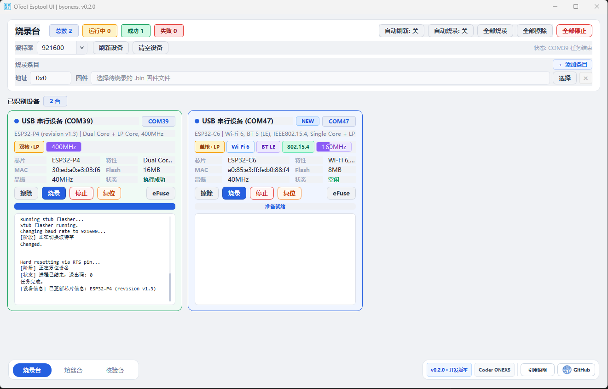

# OTool Esptool UI

> ESP 多设备识别 / 擦除 / 烧录 / eFuse 桌面工具 · v0.2.0

## Overview

OTool Esptool UI 是一个面向 Windows 串口量产场景的 PyQt6 桌面工具，提供 ESP32 系列芯片的自动识别、批量擦除、批量烧录、eFuse 读取与批量烧写能力，并内置 PyInstaller 单文件 EXE 打包方案。



## Features

### 烧录台

- 自动扫描串口并识别芯片信息（型号、MAC、Flash 大小、晶振频率）
- 多设备卡片并排显示，实时烧录进度条
- 单台 / 全部 擦除、烧录、停止操作
- 自动烧录模式：新设备接入后自动触发烧录
- **多条目烧录**：工具栏支持添加 / 删除多组地址+固件，一次烧录写入多个分区
- 地址自动从文件名末尾解析（如 `firmware_0x10000.bin`），每行独立解析
- **清空设备**：一键移除所有设备卡片并重置 NEW 状态，下次刷新全部视为新设备
- 固件目录自动扫描，启动时自动选中最新固件

### 熔丝台（eFuse 批量烧写）

- **芯片型号下拉**：从 esptool 动态读取支持列表，选定型号的设备才会被纳入烧写流程，不匹配自动跳过
- **批量状态机**：每台设备独立执行 WAITING → READING → PRE-CHECK → BURNING → VERIFYING 完整流程
- **热插拔轮询**：可开启自动检测，每 1.5 s 扫描串口，新设备自动加入队列
- **预检逻辑**：读取当前 eFuse JSON，已满足的字段跳过，存在写保护冲突时标记失败
- **强制写入**：跳过状态下可点击黄色"开始"按钮忽略预检，强制再烧一次
- **字段配置表**：可手动添加/删除字段，或从 YAML 文件导入（支持 `burn_efuse_fields` 与 `efuse_presets` 两种格式）
- 设备队列操作按钮：按状态显示 开始 / 停止 / 重试 / 烧录 / 跳过(黄)
- 操作日志带时间戳，可清空
- 提供 `esp32p4_burn_efuse_config_example.yaml` 字段配置示例

### 通用

- 内置 eFuse 对话框，支持 JSON 格式 summary 读取与预设字段烧写
- eFuse 表格列：状态 / 读写权限 / 字段名 / 当前值 / 描述，支持双击填入字段名
- 右键设备卡片 eFuse 按钮可快速烧录预设 eFuse 字段
- 多页签切换：烧录台 / 熔丝台 / 校验台（各页 toolbar 控件独立）
- Windows 11 任务栏 / 开始菜单显示自定义图标
- 单文件 EXE：通过 `otool_esptool_ui.spec` + PyInstaller 构建

## Python Version

- 最低要求：Python 3.10
- 推荐版本：Python 3.12.x

## Project Structure

```text
otool_esptool_ui/
├─ .gitignore
├─ .gitmodules
├─ LICENSE
├─ README.md
├─ THIRD_PARTY_NOTICES.md
├─ __init__.py            # 包入口，供 python -m otool_esptool_ui 使用
├─ __main__.py
├─ otool_esptool_ui.py    # 版本号单一来源（__version__）
├─ otool_esptool_ui.spec  # PyInstaller 打包规格
├─ pyproject.toml
├─ requirements.txt
├─ config.yaml            # 运行时配置（efuse_presets 预设）
├─ esp32p4_burn_efuse_config_example.yaml  # eFuse 字段配置示例（不打包）
├─ logo_all_size.ico      # 应用图标（含 16–256px 全尺寸帧）
├─ assets/
│   └─ onexs_avatar.png
├─ firmware/              # 放置待烧录 .bin 固件，启动时自动识别
├─ src/
│   ├─ bootstrap.py       # 启动分发：冻结模式/工作进程/Qt DLL 路径
│   ├─ constants.py       # 路径、版本、工具命令等常量
│   ├─ main_window.py     # 主窗口 + main() 入口
│   ├─ device_card.py     # 设备卡片控件
│   ├─ efuse_dialog.py    # eFuse 对话框（单设备）
│   ├─ efuse_batch_dialog.py  # 熔丝台批量烧写控件
│   ├─ models.py          # 数据模型
│   ├─ helpers.py         # 头像下载等辅助函数
│   ├─ styles.py          # 共享样式表
│   ├─ flow_layout.py     # 自适应流式布局
│   └─ assets/
│       └─ chevron_down.svg
└─ esptool/               # Git 子模块（espressif/esptool）
```

## Quickstart（源码运行）

```powershell
# 1. 克隆并初始化子模块
git clone --recurse-submodules <repo_url>
cd otool_esptool_ui

# 2. 创建并激活虚拟环境
python -m venv .venv
.\.venv\Scripts\Activate.ps1

# 3. 安装依赖
python -m pip install --upgrade pip
python -m pip install -r requirements.txt

# 4. 运行
python otool_esptool_ui.py
```

## Packaging

Windows 下运行 `./management_tools.ps1` 可打开管理界面，支持选择 Python 版本、自动下载 Python zip 并初始化 `.venv`、删除环境、运行程序，以及执行打包生成单文件 `dist/otool_esptool_ui.exe`。

## Changelog

### v0.2.0

- 新增「熔丝台」页：批量 eFuse 烧写，支持多设备并联、热插拔、芯片型号校验
- 熔丝台字段配置：手动添加 / YAML 文件导入（burn_efuse_fields / efuse_presets 双格式）
- 强制烧写（黄色按钮）：跳过预检、对已满足字段再次执行烧录
- 各页签 toolbar 控件独立分离（烧录台/熔丝台互不干扰）
- 多条目烧录（多组地址+固件）
- 清空设备按钮
- eFuse 对话框 JSON 解析 + 5 列布局优化
- 默认窗口尺寸 ×1.2
- 提供 `esp32p4_burn_efuse_config_example.yaml` 配置示例

### v0.1.x

- 初始版本：多设备识别、擦除、烧录、自动烧录

## License

- [OTool Esptool UI - MIT](LICENSE)
